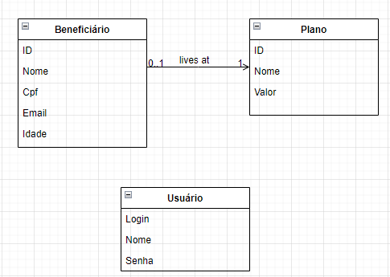

  

## Teste full-stack developer (v1)
O teste consiste em criar uma aplicação com Java que expõe uma API REST e uma aplicação web usando Angular contendo uma interface para login e acesso aos dados da API criada.

### Back-end
O teste consiste em criar uma aplicação com Java que expõe uma API REST com recursos para efetuar CRUD em usuários, beneficiários e planos. Deve-se levar em consideração alguns pontos:
- Todos os endpoints devem ter autenticação, seja ela basic, ou webtoken, ou similar. A única exceção é o endpoint para a própria autenticação.
- Fique a vontade para usar qualquer banco em memória ou em arquivo. Também poderá ser usado qualquer framework de ORM ou Object Mapping.

  

> Acima abaixo o diagrama com as classes.

### Front-end
O front-end deve apresentar pelo menos os seguintes requisitos:
  - Interface de login
    - Feedbacks de usuário ou senha incorreta
  - Tela com menu de navegação
  - Tela para CRUD de planos
  - Tela para CRUD de beneficiários
  
> Pode ser utilizado qualquer framework de UI/UX para Angular de acordo com sua preferência, mas o uso do PrimeNG seria o recomendado.

## Critérios de avaliação (por ordem de peso)
- Funcionamento do projeto
- Cumprimento dos requisitos mínimos
- Estrutura do código
- Uso de boas práticas
- Aparência final das telas

## Deve ser entregue:
- Um repositório git (fork deste)
> Não se deve fazer o commit de pastas como `node_modules` para o front ou `targer` para o back, o projeto deve instalar suas dependências a partir do `package.json` e `pom.xml`

## Extras:
- Uso do banco em memória H2
- Uso do mybatis para object mapping
- Uso do primeng como framework de UI/UX